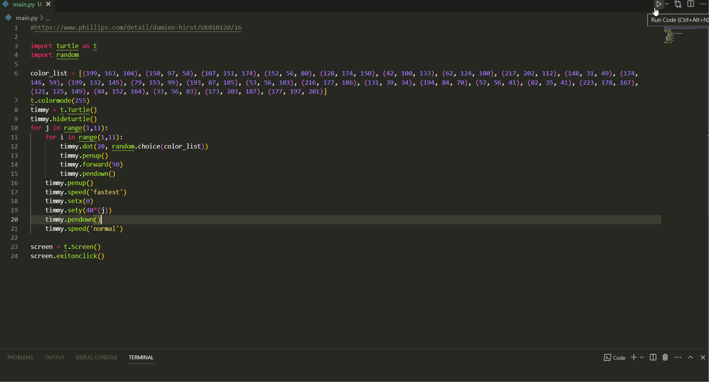

# Antipyrylazo III

["Antipyrylazo III" by Damien Hirst](https://www.phillips.com/detail/damien-hirst/UK010120/16) is a piece of artwork created by the British contemporary artist Damien Hirst in 1994. It is part of his "Spot" series, which consists of many brightly colored canvases covered in rows of colored circles of varying sizes. It sold for about £1,275,000.

This repository consists of a Python program that uses Turtle graphics to draw a colorful grid of dots, similar to Antipyrylazo III.

## Installation
This program requires Python 3 and the Turtle module (included in the standard Python library). You can download Python from the [official website](https://www.python.org/downloads/).

Once you have installed Python, clone this repository by running the following command in your terminal:

```
  git clone https://github.com/narayan9deep/AntipyrylazoIII.git
```

Navigate to the root to this repository and run the program from the terminal:

```
  python main.py
```

## Video Demo:



GIF created with [LiceCap](http://www.cockos.com/licecap/).

## Contributing

Contributions are always welcome!

## License

    Copyright 2023 DEEP NARAYAN

    Licensed under the Apache License, Version 2.0 (the "License");
    you may not use this file except in compliance with the License.
    You may obtain a copy of the License at

        http://www.apache.org/licenses/LICENSE-2.0

    Unless required by applicable law or agreed to in writing, software
    distributed under the License is distributed on an "AS IS" BASIS,
    WITHOUT WARRANTIES OR CONDITIONS OF ANY KIND, either express or implied.
    See the License for the specific language governing permissions and
    limitations under the License.